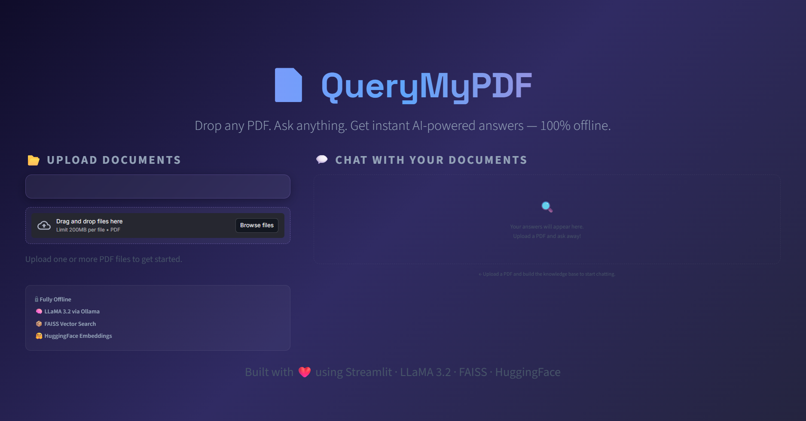
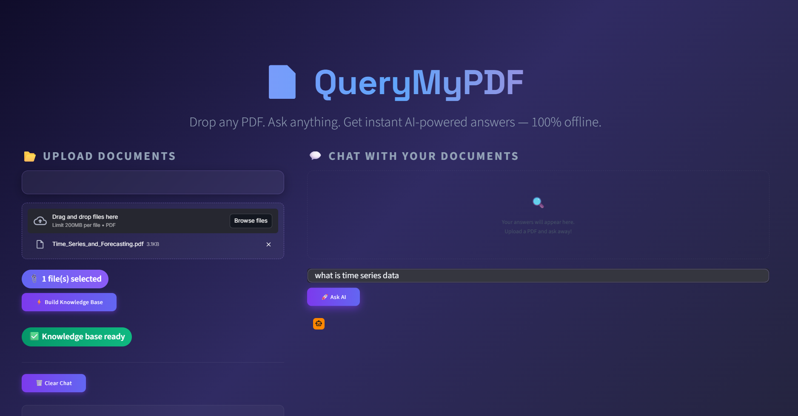
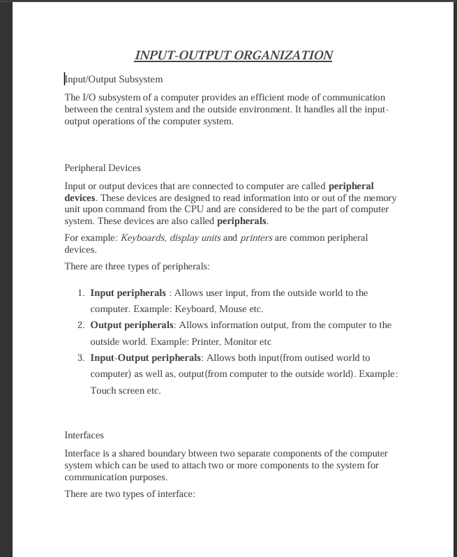
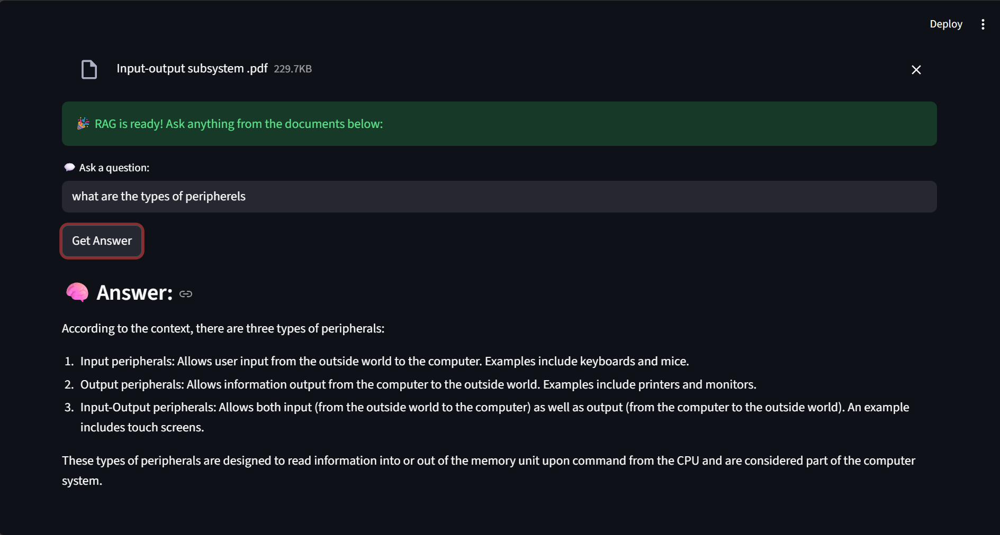
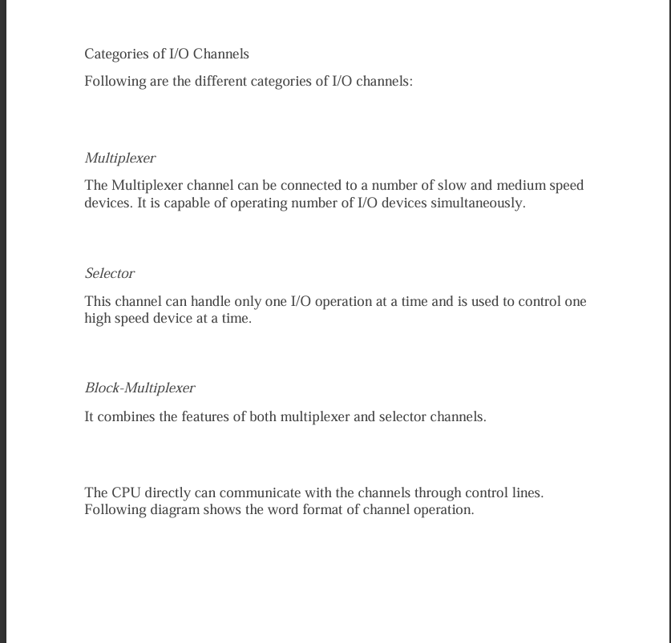
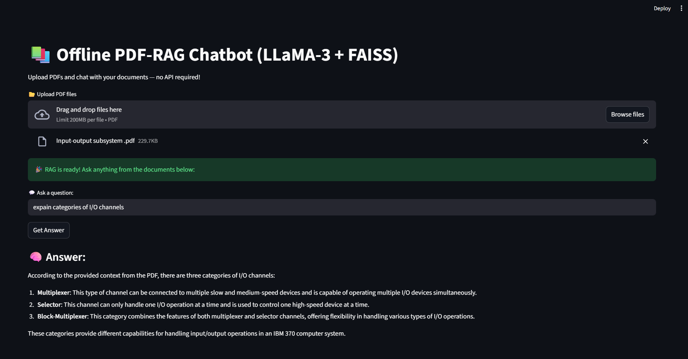

# 🚀 QueryMyPDF — Chat with Your PDFs Locally (RAG + FAISS + Llama3)

QueryMyPDF is a **fully offline AI-powered document assistant**.

Upload PDFs → Ask questions → Get intelligent answers —  
**without cloud APIs, billing, or quotas.**

---

## 🔥 Powered By

- **Ollama (Llama3 Local LLM)**
- **LangChain**
- **FAISS Vector Store**
- **HuggingFace Embeddings (all-MiniLM-L6-v2)**
- **PDFPlumber for text extraction**
- **Streamlit UI**

👉 Internet connection **not required**  
👉 No API bills or tokens  
👉 Runs entirely on your machine

---

---

## ✨ Features

✔ Upload PDFs  
✔ Extract text using PDFPlumber  
✔ Local vector embeddings (MiniLM)  
✔ RAG search over documents  
✔ Query using **Llama3** via Ollama  
✔ Shows document-referenced answers  

---

## 🧱 Architecture Overview

📄 PDF → 🔍 Extract Text
↓
🧩 Chunking → 📌 Embedding → 🎯 FAISS Vector DB
↓
🔎 Retrieval
↓
🧠 Local Llama3 → generates response using context

---

## 🛠 Tech Stack

| Component      | Technology |
|----------------|------------|
| UI             | Streamlit |
| Embeddings     | HuggingFace Sentence Transformers |
| Vector DB      | FAISS |
| Model Runtime  | Ollama |
| Local LLM      | Llama3 |
| PDF Parsing    | pdfplumber |
| RAG Logic      | LangChain community components |

---

## 📂 Project Structure

QueryMyPDF/
│── app.py # Streamlit interface
│── RAG_backend.py # Core RAG logic using Ollama
│── requirements.txt # Dependencies
│── README.md # Documentation
└── venv (ignore)

---

## 📸 Screenshots

### 📄 PDF Uploading Section
1.
  
2.
  

### 🤖 AI Response Output alongwith Source Doc
1.
  ,
2.
  ,


---


## 🔧 Installation

1️⃣ Clone repository

```bash
git clone https://github.com/chaudhary-pawan/QueryMyPDF.git
cd QueryMyPDF
```

2️⃣ Install Ollama (REQUIRED)

👉 Download from:

https://ollama.com/download

Then pull the model:

ollama pull llama3

3️⃣ Create a virtual environment
python -m venv venv

4️⃣ Install dependencies
pip install -r requirements.txt

▶️ Run the app
streamlit run app.py

---

✔ Upload PDFs
✔ Ask questions
✔ Get answers offline
